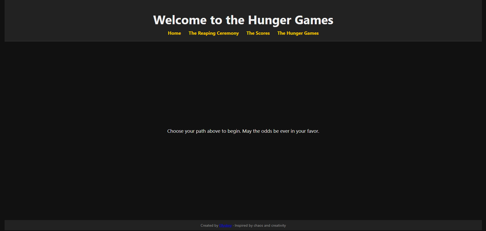
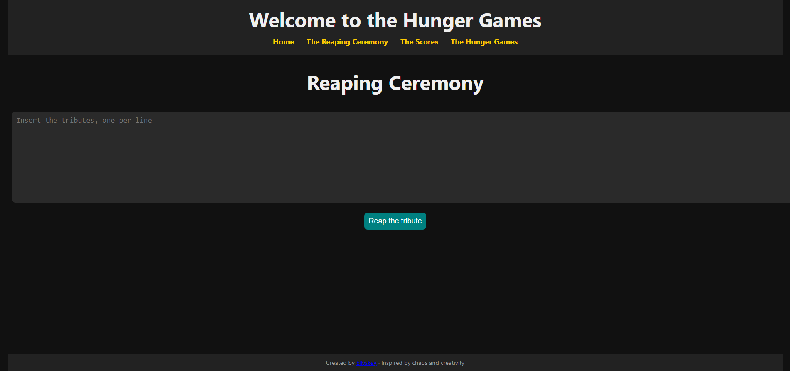
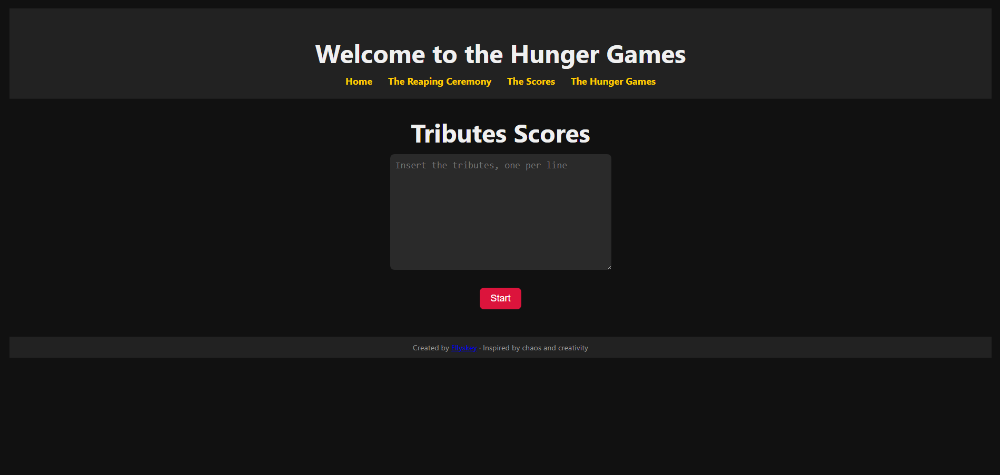
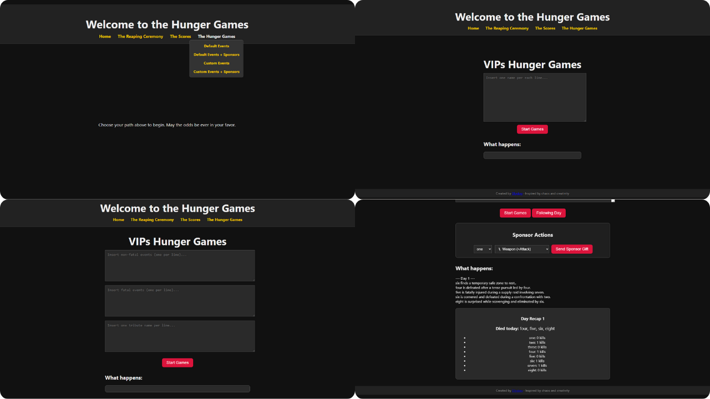

# 🏹 Twitch VIP Hunger Games Simulator

An interactive **Hunger Games style simulator** designed for Twitch communities, where tributes compete through randomized events, sponsor interventions, and cinematic ceremonies.

Built entirely with **HTML, CSS, and Vanilla JavaScript**, this project runs on **GitHub Pages**.

---

## 🌐 Overview

This simulator recreates the storytelling structure of the Hunger Games universe while allowing streamers and communities to run fully interactive events where:

- Viewers become tributes  
- Events unfold randomly  
- Sponsors can influence outcomes  
- Ceremonies build anticipation  
- One tribute is crowned the final winner  

---

# 📸 Screenshots

## 🏠 Homepage

## 🎟️ Reaping Ceremony

## 🧮 Tribute Scores

## ⚔️ Hunger Games Simulator

---

# 🧭 Website Pages

## 🏠 Homepage
Landing hub that provides navigation to all simulator features.

---

## 🎟️ Reaping Ceremony

Simulates tribute selection and district assignment.

### Features
- Insert Twitch usernames  
- Random tribute extraction  
- District assignment based on extraction order  
- Automatic Twitch profile picture retrieval  
- Animated tribute reveal  
- Progressive recap list  

---

## 🧮 Tribute Scores

Generates pre-Games tribute rankings.

### Features
- Twitch username input  
- Profile image retrieval  
- Random score generation (1-12)  
- Step-by-step reveal system  
- Final scoreboard recap  

---

# 🏟️ Hunger Games Modes

---

## ⚔️ Default Hunger Games

Uses built-in event pools.

### Includes
- Random fatal and non-fatal events  
- Daily randomized occurrences  
- Kill tracking system  
- Daily recap summaries  
- Automatic winner detection  

---

## 💰 Default Hunger Games + Sponsors

Adds viewer interaction through sponsor mechanics.

### Includes
- Sponsor buffs assigned manually by the streamer  
- Tribute advantage system  
- Enhanced storytelling potential  

---

## 🛠️ Custom Events Hunger Games

Allows full customization of events.

### Includes
- Custom fatal event input  
- Custom non-fatal event input  
- Default fallback if left blank  

---

## 🎁 Custom Events + Sponsors

Complete advanced simulator mode.

### Includes
- Custom event system  
- Sponsor mechanics  
- Maximum storytelling flexibility  

---

# 🎮 Core Mechanics

## 🎲 Random Event Engine
Each day generates:
- Random number of survival events  
- Random elimination attempts  

---

## ☠️ Elimination System
- Tributes are removed when eliminated  
- Kill counts are tracked  

---

## 📊 Daily Recap
Displays:
- Eliminated tributes  
- Kill leaderboard  

---

## 🏆 Winner Detection
Simulation ends automatically when only one tribute remains.

---

# 🎥 Twitch Interaction Concept

Designed to integrate with live streams using:

### Channel Point Redeems
Viewers can:
- Sponsor tributes  
- Influence narrative moments  
- Create dynamic audience participation  

*(Sponsor effects are manually applied by the streamer.)*

---

# 🧰 Tech Stack

- HTML5  
- CSS3  
- Vanilla JavaScript  
- Twitch Public APIs (Profile images)  
- Web Components (Custom Header & Footer)

---

# 📁 Project Structure

